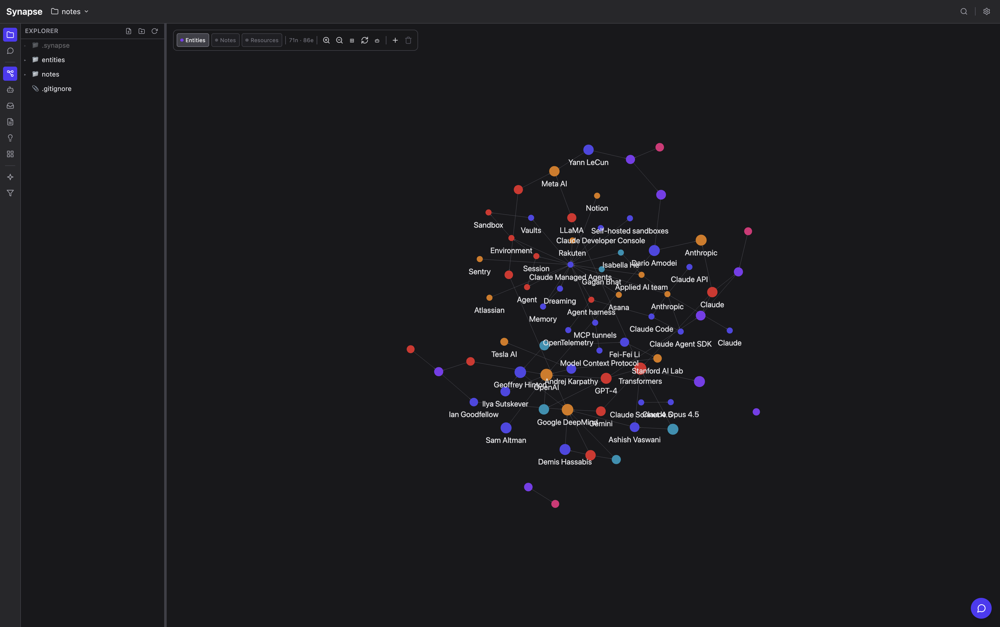
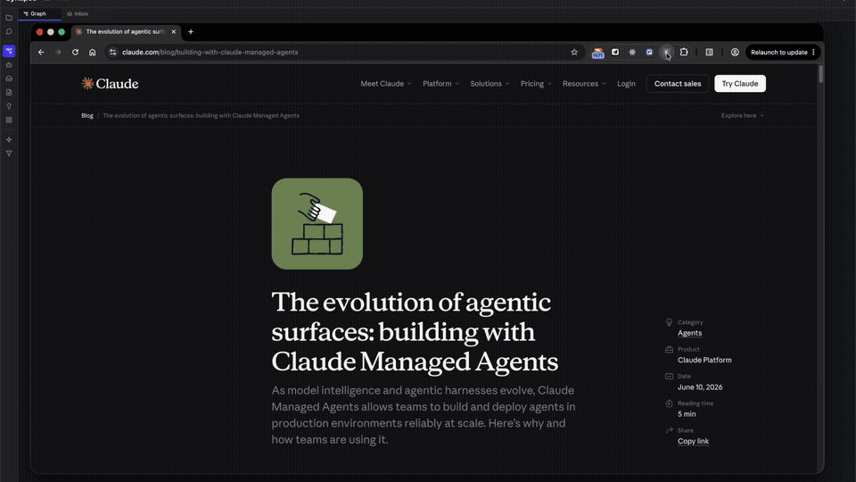
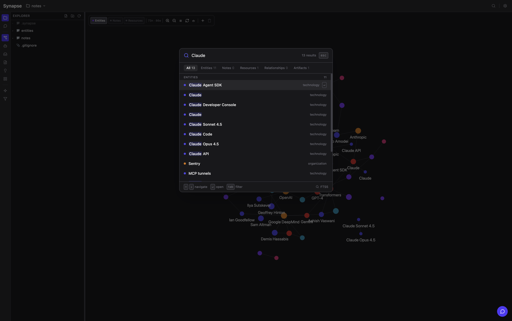
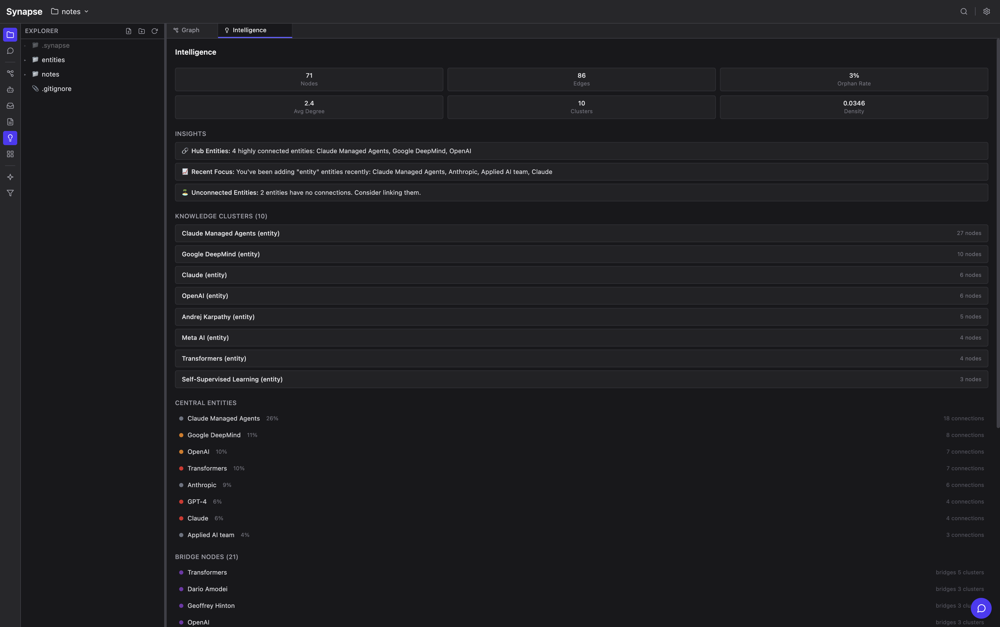
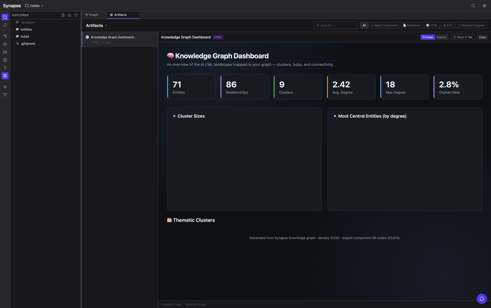
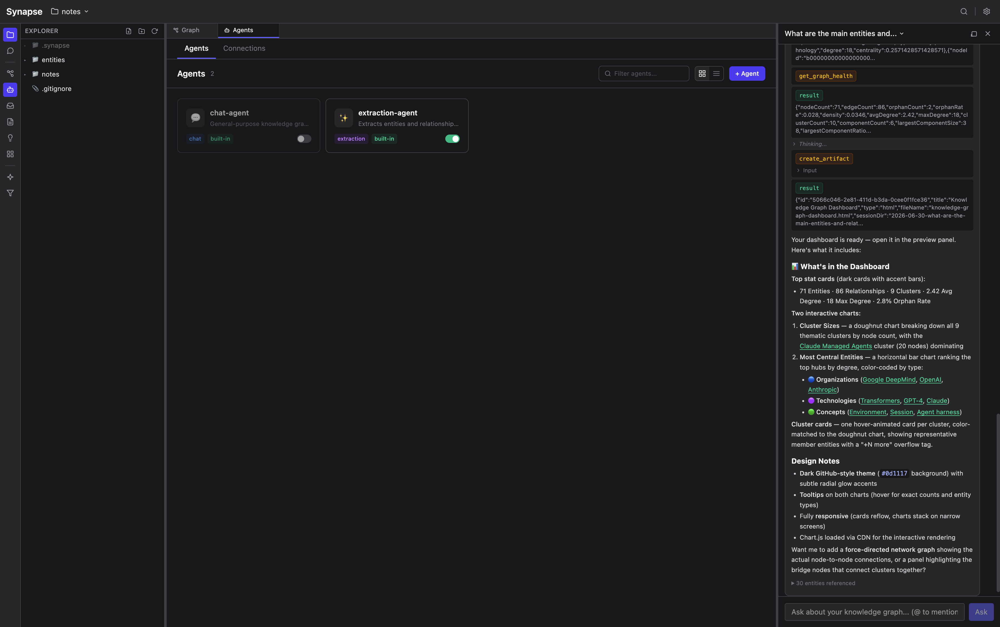
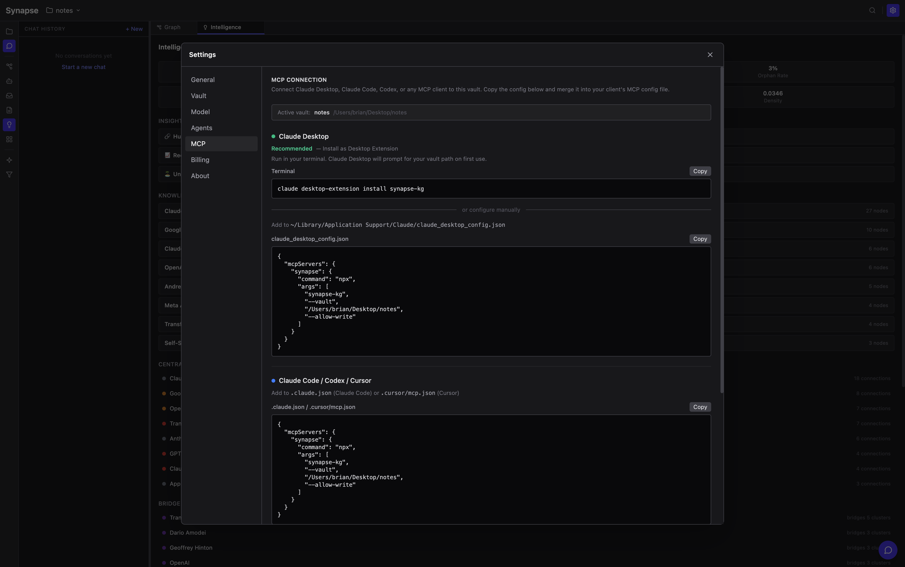

# Synapse

Turn articles, notes, and conversations into a structured knowledge graph. Paste a URL, review what the LLM extracted, and watch your graph grow — with entity resolution, provenance tracking, and typed relationships. Everything runs locally on your machine.



## How it works

**1. Capture** — Browse an article and send it to your vault with one click using the companion extension. The LLM extracts typed entities (people, organizations, technologies, concepts) and labeled relationships. Choose Quick (single LLM call) or Deep (agentic with DOM inspection).



**2. Review** — Nothing touches the graph without your approval. A visual diff shows every entity and relationship the LLM found, with merge recommendations for duplicates. Edit inline, remove noise, accept what's useful.


**3. Explore** — Entities appear as color-coded nodes with force-directed layout. Click any node to see its properties, relationships, and source provenance. Search with full-text (FTS5) or semantic similarity (vector embeddings).



**4. Analyze** — The Intelligence panel shows graph health at a glance: clusters, central entities, bridge nodes, orphan detection, and density metrics.



**5. Ask** — Chat with an agent that has full access to your graph. It uses tool calls (search, traverse, inspect) to ground answers in your actual data — not hallucinated associations.


**6. Generate** — Ask the agent to create artifacts: interactive dashboards, visualizations, reports. Artifacts are persisted in the vault and browsable from the Artifacts panel.



## Agents and artifacts

Define custom agents with per-agent tool access, system prompts, and MCP server connections. Each agent gets its own tool filter — restrict one to read-only graph queries, give another full write access.



## MCP integration

Synapse is both an **MCP server** and an **MCP client**. Any MCP-compatible agent can search, create, and analyze your graph.



**Connect Claude Desktop** (recommended):
```bash
claude desktop-extension install synapse-kg
```

**Or configure manually** — add to `claude_desktop_config.json`:
```json
{
  "mcpServers": {
    "synapse": {
      "command": "npx",
      "args": ["synapse-kg", "--vault", "/path/to/vault", "--allow-write"]
    }
  }
}
```

**Connect to the running app** (HTTP, requires Synapse open with a vault):
```json
{
  "mcpServers": {
    "synapse": {
      "url": "http://127.0.0.1:19876/mcp"
    }
  }
}
```

The Settings > MCP tab shows the exact config with your vault path pre-filled — just copy and paste.

### Available tools

| Tool | Description |
|------|-------------|
| `search` | Find entities, notes, and sources with relevance scoring |
| `get_entity` | Full entity details: properties, relationships, aliases |
| `get_neighbors` | Traverse the graph from a starting entity |
| `manage_entity` | Create, update, or delete entities |
| `manage_relationship` | Create, update, or delete relationships |
| `merge_entities` | Deduplicate entities with edge transfer |
| `manage_note` | Read, create, or update markdown notes |
| `analyze_graph` | Graph intelligence: overview, health, centrality, paths |

Access control profiles in `.synapse/mcp-server.json` control which tools each agent can use (read-only, editor, full access).

As an **MCP client**, Synapse connects to external servers (GitHub, Notion, etc.) so your chat agent can pull context from other systems.

## Getting started

```bash
git clone <repo-url>
cd kg_extension
npm install
npm run dev:electron    # Build + launch
```

On first launch, create or open a **vault** — a folder that holds your graph database, notes, and files.

1. Open **Settings** (gear icon) and enter your Anthropic API key
2. Start extracting from URLs, pasted text, or dropped files
3. Optionally configure OpenAI for vector embeddings (semantic search)

### MCP server (for Claude Desktop / Claude Code / Codex)

```bash
npm run build:mcp

# Add to claude_desktop_config.json — see MCP integration above
```

## Architecture

```
UI (React + Zustand) → @platform → Main Process → External (SQLite, LLM, FS)
```

| Component | Technology | Role |
|---|---|---|
| **Database** | SQLite (better-sqlite3) | Source of truth. FTS5 search, WAL mode, 16 repository interfaces |
| **Graph renderer** | Three.js (InstancedMesh) | 1-2 draw calls for 100k+ nodes. Web Worker force layout |
| **LLM extraction** | Anthropic (agentic), OpenAI | Page, text, and file ingestion with human review |
| **Chat agent** | Tool-use loop | RAG retrieval (FTS5 + vector hybrid), graph traversal, agent memory |
| **MCP server** | HTTP + stdio | 8 tools with profile-based access control |
| **Vector search** | sqlite-vec + ONNX/OpenAI | Semantic similarity, hybrid retrieval with RRF fusion |
| **Vault** | Local filesystem | Single directory with graph DB, notes, embeddings, config |

See [ARCHITECTURE.md](ARCHITECTURE.md) for the full system design, SQLite schema, and worker patterns.

## Tech stack

React 19, TypeScript, Vite 7, Zustand 5, Three.js, Tailwind CSS 4, better-sqlite3, sqlite-vec, Zod 4, @modelcontextprotocol/sdk

## References

- [LLM Wiki](https://gist.github.com/karpathy/442a6bf555914893e9891c11519de94f) — Karpathy's pattern for LLM-maintained personal knowledge bases
- [ARCHITECTURE.md](ARCHITECTURE.md) — Full system design, SQLite schema, worker patterns

## License

MIT
