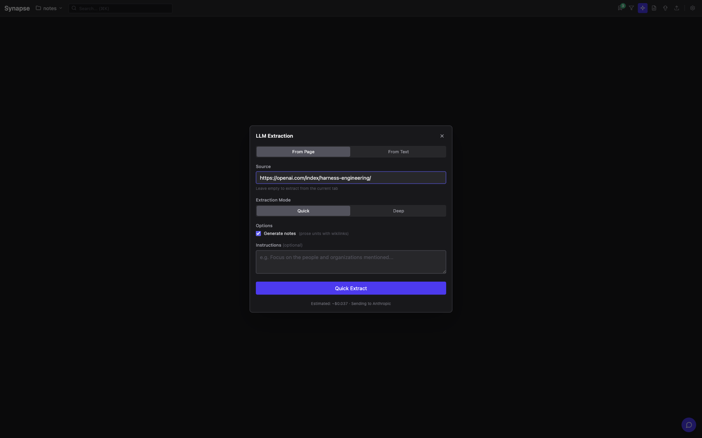
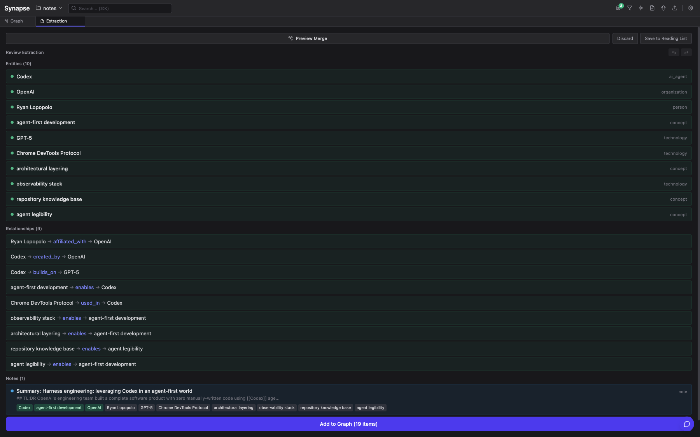
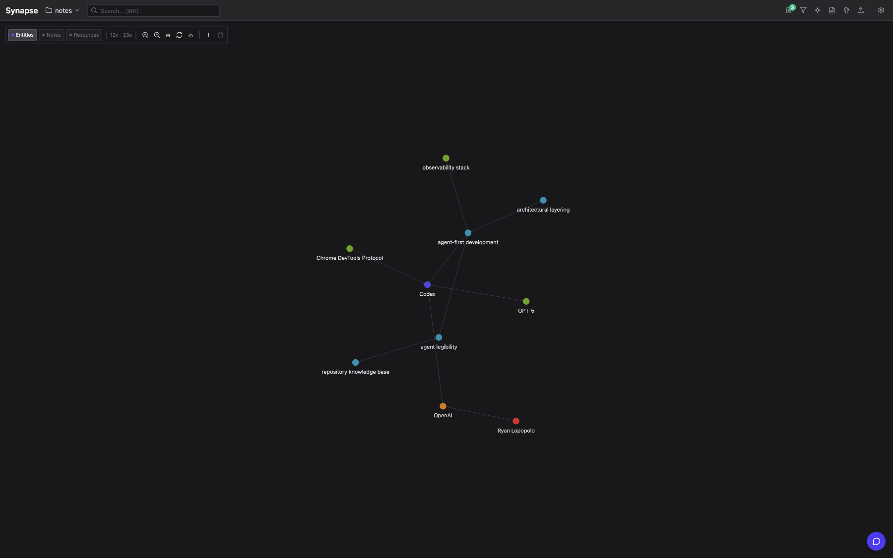
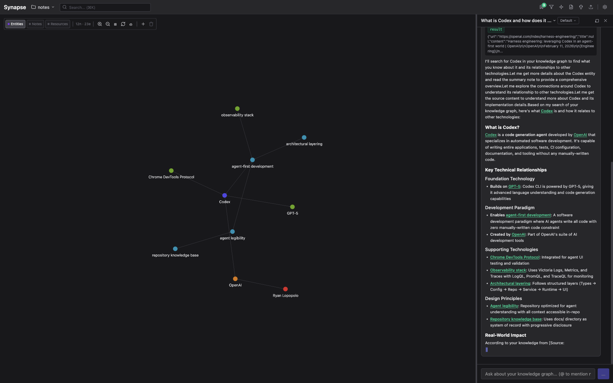

# Synapse

A local-first knowledge graph that turns articles, notes, and conversations into a structured, queryable graph. LLM-powered extraction with human review, entity resolution, provenance tracking, and an agent chat interface — all running on your machine.

## Why Synapse

Andrej Karpathy's [LLM Wiki](https://gist.github.com/karpathy/442a6bf555914893e9891c11519de94f) introduced a compelling pattern: instead of re-deriving answers from raw documents on every query, have an LLM incrementally build a persistent, interlinked wiki that compounds over time. The LLM handles the boring bookkeeping — touching 15 files in one pass, maintaining cross-references, linting for contradictions.

The pattern works. What it lacks is **data governance**:

| LLM Wiki (flat markdown) | Synapse (structured graph) |
|---|---|
| Untyped markdown links | Typed edges (`created_by`, `studied_at`, `builds_on`) |
| No deduplication | Entity resolution with fuzzy matching + merge |
| Convention-based schema | Enforced node types (`person`, `technology`, `concept`) |
| No provenance chain | Source tracking per edge (extraction, user, agent) |
| LLM compliance assumed | Human review step before any graph mutation |
| Single flat namespace | SQLite with FTS5, spatial indexing, vector embeddings |
| No external access | MCP server exposes graph to Claude Code, IDEs, other agents |

Synapse is the **harness layer** — it takes the LLM wiki's "paste → extract → compound" loop and wraps it in the governance that makes it reliable: entity resolution catches duplicates, typed relationships make traversal meaningful, provenance lets you trace any claim back to its source, and human review ensures nothing enters the graph unchecked.

## Architecture

```
┌─────────────────────────────────────────────────────────────┐
│                        Electron App                         │
│  ┌──────────────────────┐   ┌────────────────────────────┐  │
│  │     Main Process     │   │     Renderer (React 19)    │  │
│  │  ┌────────────────┐  │   │  ┌──────────────────────┐  │  │
│  │  │  VaultManager  │  │   │  │   Zustand Stores     │  │  │
│  │  │  SQLite (b-s3) │  │   │  │  (graph, ui, llm,    │  │  │
│  │  │  FileWatcher   │  │   │  │   node-type, review) │  │  │
│  │  │  EventBus      │  │◄─┤  ├──────────────────────┤  │  │
│  │  ├────────────────┤  │IPC│  │  Three.js Renderer   │  │  │
│  │  │  LLM Backend   │  │   │  │  (InstancedMesh)     │  │  │
│  │  │  (Anthropic,   │  │   │  ├──────────────────────┤  │  │
│  │  │   OpenAI)      │  │   │  │  Web Worker          │  │  │
│  │  ├────────────────┤  │   │  │  (Force Layout)      │  │  │
│  │  │  MCP Server    │──┤───┤──┴──────────────────────┘  │  │
│  │  │  (HTTP+stdio)  │  │   └────────────────────────────┘  │
│  │  ├────────────────┤  │                                   │
│  │  │  MCP Client    │──┼── External MCP Servers            │
│  │  └────────────────┘  │                                   │
│  └──────────────────────┘                                   │
└─────────────────────────────────────────────────────────────┘
         │                              │
    ┌────┴────┐                  ┌──────┴──────┐
    │  Vault  │                  │ Claude Code  │
    │ (.kg/)  │                  │  IDE, other  │
    │ graph.db│                  │   agents     │
    │ notes/  │                  │  (via MCP)   │
    └─────────┘                  └─────────────┘
```

### Key Components

| Component | Technology | Role |
|---|---|---|
| **Database** | SQLite (better-sqlite3) | Source of truth. FTS5 full-text search, WAL mode, 16 repository interfaces |
| **Graph Renderer** | Three.js (custom InstancedMesh) | 1-2 draw calls for 100k+ nodes. Web Worker force layout (Barnes-Hut O(n log n)) |
| **LLM Extraction** | Anthropic (agentic), OpenAI | Three modes: page extraction with DOM tools, text extraction, file ingestion |
| **Extraction Review** | React + Zustand | Visual diff with merge recommendations, undo/redo, inline editing |
| **Chat Agent** | Tool-use loop | RAG retrieval (FTS5 + vector hybrid), 30+ graph tools, agent memory |
| **MCP Server** | HTTP (companion server) + stdio CLI | Exposes graph as 18 MCP tools to external agents. Write-gated. |
| **MCP Client** | stdio child processes | Connect to external MCP servers (GitHub, Notion, etc.) |
| **Vector Search** | sqlite-vec + ONNX/OpenAI | Semantic similarity search, hybrid retrieval with RRF fusion |
| **Platform Layer** | 6 interfaces | Shared codebase between Electron (primary) and Chrome extension (deprecated) |

### MCP Integration

Synapse is both an **MCP server** (exposing graph tools) and an **MCP client** (consuming external servers).

**As a server**, any MCP-compatible agent (Claude Code, Cursor, custom agents) can search, create, and traverse the graph:

```bash
# Install as Claude Desktop Extension
npx @anthropic-ai/mcpb publish packages/synapse-mcp/

# Or configure in Claude Code .mcp.json
{
  "synapse": {
    "command": "node",
    "args": ["packages/synapse-mcp/dist/index.js", "--allow-write"]
  }
}
```

Tools exposed: `search_nodes`, `create_node`, `create_edge`, `get_neighbors`, `get_subgraph`, `merge_nodes`, `create_note`, `read_note`, and 10 more.

### Chrome Extension (Deprecated)

The Chrome extension shares 95% of the codebase via the platform abstraction layer (`src/platform/{chrome,electron}/`). It uses wa-sqlite with OPFS instead of better-sqlite3, and runs the LLM loop in an offscreen document. No new features target it — the Electron app provides vault management, file watching, MCP, and ONNX embeddings that aren't possible in the extension sandbox.

## Workflows

### Entity Extraction

Paste a URL or text, and the LLM extracts structured entities and relationships with typed labels. A review step lets you approve, edit, or merge before anything touches the graph.

**1. Start extraction** — Enter a URL or paste text. Choose Quick (single LLM call) or Deep (agentic with DOM inspection).



**2. Review extracted entities** — The LLM returns typed entities (person, organization, technology, concept) and labeled relationships. Review before committing.



**3. Graph populated** — Entities appear as color-coded nodes with force-directed layout. Edges represent the extracted relationships.



*Demo: extracting from [Harness engineering: leveraging Codex in an agent-first world](https://openai.com/index/harness-engineering/) by Ryan Lopopolo (OpenAI). Synapse identified 10 entities across 5 types and 9 relationships in a single extraction.*

### Agent Chat

Ask questions about your graph in natural language. The agent uses tool calls (search, traverse, inspect) to ground its answers in your actual data.



*The agent searched the graph, found Codex and its connections, and returned a structured answer with entity references — all grounded in the extracted knowledge, not hallucinated.*

## Getting Started

### Electron (Primary)

```bash
git clone <repo-url>
cd kg_extension
npm install
npm run dev:electron    # Build + launch
```

On first launch, create or open a **vault** — a folder that contains your graph database, notes, and files.

### Configuration

1. Open **Settings** (gear icon) and enter your Anthropic API key
2. Optionally configure OpenAI for embeddings (semantic search)
3. Start extracting from URLs, pasted text, or dropped files

### MCP Server (for Claude Code / IDE integration)

```bash
npm run build:mcp
# Then add to your .mcp.json (see MCP Integration above)
```

## Tech Stack

React 19, TypeScript, Vite 7, Zustand 5, Three.js, Tailwind CSS 4, better-sqlite3, sqlite-vec, Zod 4, @mozilla/readability, @modelcontextprotocol/sdk

## References

- [LLM Wiki](https://gist.github.com/karpathy/442a6bf555914893e9891c11519de94f) — Karpathy's pattern for LLM-maintained personal knowledge bases
- [Harness engineering](https://openai.com/index/harness-engineering/) — OpenAI's experiment building with zero manually-written code
- [ARCHITECTURE.md](ARCHITECTURE.md) — Full system design, SQLite schema, worker patterns

## License

MIT
