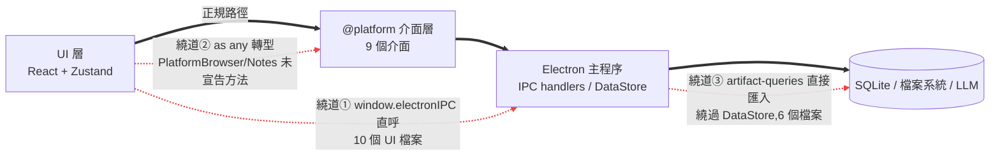
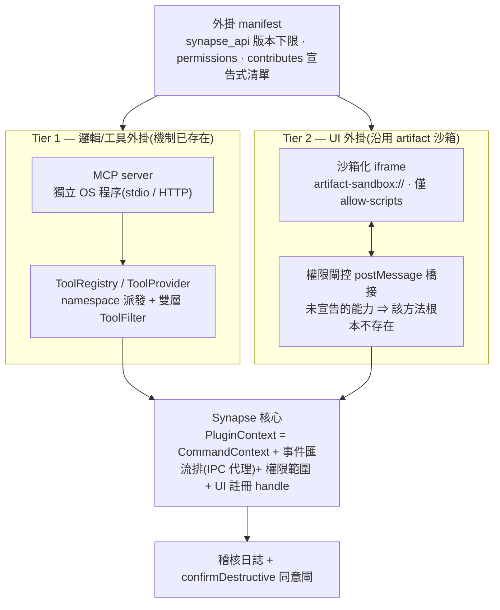
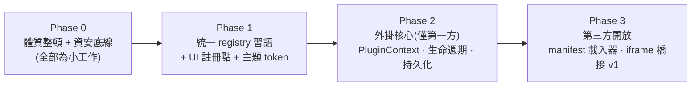

# Synapse 架構評估 — 模組化與外掛就緒度

> **日期:** 2026-06-10 · **分析分支:** `theme`(自 `desktop` 切出)
> **方法:** 8 條唯讀研究線 — 6 個平行程式碼分析 agent(約 59.2 萬 tokens、474 次工具呼叫)、1 次機械式 import 圖譜稽核,以及既有外掛架構的網路調查(Obsidian、VS Code、Logseq、Joplin、Figma、MCP/.mcpb)。關鍵論斷皆經原始碼抽查驗證。
> **狀態:** 僅評估,未修改任何程式碼。檔案:行號引用為本次 commit 當下的快照。

---

## 執行摘要

宣告的架構是**真實且經機械式驗證的** — 這很難得。UI 程式碼中零 `chrome.*`/`ipcRenderer` 引用(僅一處註解)、`src/core/` 零 `@platform` 匯入、12 個 Zustand store 之間零交叉匯入、渲染程序程式碼從不匯入 `electron/`、三層資料庫抽象確實逐層委派。外掛系統的骨架其實**已經以另一種形式存在**:`ToolProvider`/`IToolRegistry`、帶雙層 `ToolFilter` 強制的 agent `.md` manifest、vault 事件匯流排、artifact 沙箱,以及雙向 MCP。

距離「外掛就緒」還有兩個系統性問題:

1. **侵蝕(erosion)**:正規的架構接縫擴充成本太高,於是較新的功能選擇**繞道**(10 個 UI 檔案直呼 `window.electronIPC`、用 `as any` 跨過不完整的平台介面、artifact 子系統完全繞過 `DataStore`)。一個連第一方程式碼都在迴避的公開介面,不可能成為外掛 API。
2. **缺少的管線**:四個獨立 agent 收斂到相同結論 — **全程式碼庫沒有任何版本管理、沒有 runtime 注入機制、沒有信任模型**(無使用者同意、無稽核、且存在多處強制機制被繞過)。

對「保持精簡」目標的好消息:正確的外掛架構在這裡多半是**重用與整併**既有資產(MCP 層 + artifact 沙箱層 + registry 統一),而非新建一個平台。淨表面積可以大致持平,擴充性卻能上升 — 與「模組化但精簡」的目標一致。

---

## 1. 經驗證的強項

| 主張 | 驗證結果 |
|---|---|
| UI 從不直接觸碰 `chrome.*` / `ipcRenderer` / `from 'electron'` | grep `src/ui` + `src/graph`:1 筆命中,且為註解(`src/ui/App.tsx:119`) |
| `src/core/` 平台純淨(依賴全由參數注入) | 0 筆 `@platform` 匯入;依賴經 `StreamFn`、`ToolExecutor`、`UsageStore` 進入 |
| 渲染程序不匯入 `electron/` 原始碼 | 0 筆命中 |
| 12 個 Zustand store,零交叉匯入 | 已確認;跨 store 協調僅發生在 hook 邊界的 `getState()` |
| 三層資料庫抽象屬實 | `SqliteDataStore` 為純委派;`query-executor` 函式可於執行期抽換 |
| `CommandContext` 依賴注入跨程序成立 | `src/commands/create-context.ts:39-53`(渲染程序)與 `electron/mcp/main-process-context.ts:17-63`(主程序)建構同一型別 |
| 工具契約為供應商中立的 JSON Schema | `electron/mcp/types.ts:1-6`;可直接對映 MCP SDK 與 Anthropic 格式 |
| Artifact 沙箱隔離強度高 | 獨立 `artifact-sandbox://` origin、僅 `sandbox="allow-scripts"`、postMessage 來源驗證(`JsxRenderer.tsx:18`) |
| MCP server 以獨立程序執行 | 經 `StdioClientTransport` 的 stdio 子程序 |

## 2. 侵蝕模式(最重要的內部發現)

每一層抽象都長出了非官方的繞道:



| 正規接縫 | 繞道方式 | 證據 |
|---|---|---|
| `@platform` 別名 | **10 個 UI 檔案直呼 `window.electronIPC`**:vault-explorer 系列、`VaultSwitcher`、`ViewerTab`、`TabLayout`、`AgentDetailView`、`ExtractionProgress`、`chat-agent-loop` | `src/ui/components/vault-explorer/useVaultFileSystem.ts`(9 個呼叫點)等 |
| `PlatformBrowser`(宣告 5 個方法) | 實作攜帶 **10+ 個未宣告方法**,以 `as any` 存取(`analyzePage`、`fetchUrl`、`toggleDisplayMode`、`sendOAuth`、`onRuntimeMessage`…) | `src/platform/types.ts:140-146` vs `src/ui/hooks/useContextualRelevance.ts:75,91,95,110`、`src/graph/store/auth-store.ts:23,33,46,64` |
| `PlatformNotes` | 3 個 Electron 限定方法以 `notes as any` 存取 | `src/platform/electron/notes.ts:42-52`、`SettingsPanel.tsx:368` |
| `DataStore` | Artifact 完全繞過(6 個檔案直接匯入 `artifact-queries`);調和(reconciliation)使用裸 `db.prepare()`;`DbNode` 缺少 migration 012 新增的 `content_hash` 欄位 | `electron/main.ts:34`、`electron/vault/reconciliation.ts:56-248` |
| `PlatformDB` | 本身就是字串型 RPC 漏斗:`request(action: string, params?: unknown): Promise<unknown>` — 真正的契約藏在未文件化的 action 字串裡 | `src/platform/types.ts:20-24` |

附註:`src/platform/types.ts` 實際定義了**九個**介面 — `PlatformFiles` 存在但不在 CLAUDE.md 列出的八個之中;`PlatformEmbedding` 定義於 `src/embeddings/types.ts` 再轉出。

**修法是雙向的**:讓介面便宜到值得擴充(§8 Phase 0),同時強制邊界(lint 規則:`src/platform/` 之外禁止 `electronIPC` 與平台物件的 `as any` 轉型)。

## 3. 程式碼庫中已具外掛雛形的資產(在這些之上構建,不要重新發明)

- **`ToolProvider` / `IToolRegistry`**(`electron/mcp/types.ts:22-41`):id、namespace、listTools、executeTool、dispose、`onToolsChanged`。全庫最成熟的 registry;MCP server 已經透過它接入。pipelines 分析提名它為統一收斂的目標模式。
- **Agent `.md` 定義**:YAML frontmatter → `AgentDefinition` → `toToolFilter()`,在列舉**與**執行兩層強制(`tool-registry.ts:30-49`、`mcp-ipc.ts:19-29`)。這是「帶能力閘控的 manifest」的現成先例。
- **Artifact 沙箱**:可運作的 postMessage 協定(INIT/RENDER/READY/ERROR/RESIZE)、內建 React/Recharts/D3 vendor bundle、自訂 protocol handler。UI 與資安兩條分析線各自獨立提名它為外掛 UI 的執行場域。
- **Vault 事件匯流排**:型別化 pub-sub、每個 handler 各自 try/catch(`event-bus.ts:39-48`)、`markAsAppWritten()` 迴圈抑制(`file-watcher.ts:56-59`)。`vault:opened`/`vault:closing` 已在發送(`vault-manager.ts:75,84`)但**從未有人訂閱** — 外掛生命週期 hook 已經在對空氣發射。
- **現役註冊函式**:`registerStreamFn()`/`registerExtractionFn()`(`electron/llm-backend.ts:28-38`)、`registerProcessor()`(`src/ingestion/processor-factory.ts:7`)、`registerProvider()`(tool registry)。
- **資料驅動的節點型別**:`ontology_node_types` 資料列 + 執行期 `NodeTypeRepository.create()`;休眠中的 `properties_schema` + `parent_type` 欄位等待啟用。
- **節點與邊的 `properties` JSON 欄位**(自 migration 001 起預設 `'{}'`)。
- **`AccessProfile`**(`electron/mcp/types.ts:58-63`):MCP server 側已建模的能力範圍(read/write + allow/block 清單)。

## 4. 缺口分析

| 缺口 | 細節 | 提出者 |
|---|---|---|
| 無 runtime 注入 | `@platform` 在打包期解析(`vite.config.electron.ts:135`);樹外程式碼永遠拿不到。`CommandContext`(`src/commands/types.ts:6-18`)是 `PluginContext` 的天然原型,但缺事件、權限、UI handle | platform-core |
| 零版本管理 | 平台介面、ToolProvider、四個管線介面 — 沒有任何 API 版本常數、能力偵測或棄用標記 | platform-core、tools-mcp、pipelines、build-security |
| 無信任模型 | 無同意提示、無稽核日誌;`guardrails.confirmWrites/confirmDestructive` 有解析、**從未強制**;MCP 工具 `category: undefined` 會**靜默繞過**能力過濾(`tool-registry.ts:42`) | tools-mcp |
| Registry 碎片化 | 四種各自發明的習語:Record(LLM)、可變陣列(ingestion)、私有 `startsWith` 鏈(embeddings,`embedding-service.ts:68-84`)、寫死的呼叫點(memory,`useChatSession.ts:170`) | pipelines |
| 型別鎖死 | `LLMProvider = 'anthropic'` 寫死在 `src/shared/types.ts:272`、`schema.ts:111`、`constants.ts:37-42` 三個檔案 + 寫死的 `<option>`;`ExtractionStreamFn` 直接是 `typeof anthropicExtractionStream` | pipelines |
| 所有 UI 表面皆寫死 | 側欄(3 值 union + ITEMS 陣列)、右側面板(8 路 switch)、分頁(union + if-else)、工具列(行內 JSX)、設定頁(TABS 常數)、右鍵選單(1 個動作)、完全沒有快捷鍵系統 | ui-state |
| 無外掛持久化 | 單一整數序列的 migration(第三方必然碰撞)、無 KV store、無 `.kg/plugins/` 鷹架、無 properties 命名空間慣例 | data-vault |
| 文件宣稱但實為殘樁的功能 | `mcp:connect-server` 回傳假成功的 no-op(`mcp-ipc.ts:39-43`);HTTP transport 僅 warn 殘樁;memory「Phase 2」檢索器未實作 | tools-mcp、pipelines |

## 5. 資安底線(開放任何第三方程式碼之前必修;這些在今天就有影響)

| # | 問題 | 證據 | 修法 |
|---|---|---|---|
| 1 | preload 全開漏斗:`invoke(channel, ...args)` 任意字串直通任意 handler,且視窗 `sandbox: false` | `electron/preload.ts:4`、`electron/main.ts:67-69` | preload 內建 channel 允許清單 |
| 2 | 任意磁碟讀寫:`vault-explorer:*` 接受未驗證的絕對路徑 | `electron/main.ts:425-486` | 套用既有 `validatePath()` 模式(`files-backend.ts:35-46`) |
| 3 | IPC 裸 SQL:`db:request` 的 `action='exec'/'query'` 未消毒直達 better-sqlite3 | `electron/main.ts:140`、`action-handler.ts:41-52` | 從渲染程序表面移除或閘控 |
| 4 | `activeToolFilter` 競態:模組層級單例被所有視窗/請求共享 | `electron/mcp/mcp-ipc.ts:4,10,19` | 以 `event.sender.id` 為鍵,或把 filter 隨 execute payload 傳遞 |
| 5 | MCP 工具 `category` 未定義 ⇒ 能力過濾被靜默繞過 | `mcp-tool-provider.ts:22-26` + `tool-registry.ts:42` | 未知者預設為 `'execute'` |
| 6 | Companion server CORS `*`(127.0.0.1:19876)— 任何本機網頁皆可注入圖譜內容 | `electron/companion-server.ts:16-19` | origin 允許清單 |
| 7 | `MarkdownRenderer` iframe:`allow-scripts allow-same-origin`(可逃逸沙箱的組合) | `MarkdownRenderer.tsx:151` | 移除 `allow-same-origin` |
| 8 | macOS 發行無 notarization/hardened-runtime 設定 | `package.json`(無 afterSign/entitlements) | 接上 `@electron/notarize`;沙箱 `new Function()` 需 `allow-jit` entitlement |

次要:研究重新啟用 `sandbox: true`(受 SharedWorker 牽制;替代方案:dedicated worker 或以 `utilityProcess` 跑 SQLite)。

## 6. 既有外掛架構調查(濃縮版;完整筆記見附錄 A8)

| 系統 | 模型 | 對 Synapse 的啟示 |
|---|---|---|
| **Obsidian** | 完全信任的渲染程序外掛、命令式 `app` API、`manifest.json` + `minAppVersion`、GitHub 發佈 + 自動掃描 | 最豐富的 UI API → 最大的生態系;但有真實世界惡意事件;2025 路線圖加入能力揭露標籤,仍不沙箱化。學它的生命週期/註冊人體工學,別學信任模型 |
| **VS Code** | 擴充主機獨立程序(Electron `utilityProcess`)、宣告式 `contributes` 與命令式 API 分離、延遲啟用、proposed-API 閘 | 宣告/命令分離換來安裝期能力展示與延遲載入。學 `engines` 式 API 下限 + proposed-API 紀律 |
| **Logseq** | 沙箱化 iframe + `@logseq/libs` SDK over postMessage;`effect: true` 逃生口 | 驗證了 iframe 模型;全非同步的 DX 成本真實存在;逃生口一旦存在就會變成預設路徑 — **不要提供** |
| **Joplin** | 每外掛一個 BrowserWindow + RPC 橋接;無權限宣告 | 沒有權限的程序隔離只是隔離劇場;每外掛一視窗對單人維護者不可持續 |
| **Figma** | 主執行緒 QuickJS/WASM realm + iframe UI 分離 | 只有「同步存取主執行緒文件模型」才值得這個複雜度;Synapse 的資料路徑本來就是非同步 IPC — 跳過 |
| **MCP / .mcpb** | 每外掛一程序、manifest 含 `user_config`(keychain 支援)、動態工具發現 | 工具/資料層的絕佳選擇(Synapse 已出貨);結構上做不到 UI 貢獻與 app 事件 hook(MCP Apps 尚在萌芽) |

## 7. 建議架構:雙層 + 單一 manifest



**Tier 1 — 邏輯/工具外掛 = MCP server**(今天就存在,把它正規化):
- 修復 `mcp:connect-server` 殘樁、實作 HTTP/SSE transport、修 category 閘控、加上執行稽核日誌。
- 發佈:`.mcpb` 式 bundle,走既有 `.kg/mcp.json` 流程。程序隔離免費取得。

**Tier 2 — UI 外掛 = 沙箱化 iframe**(建立在 artifact 基礎設施上):
- 權限閘控的 postMessage 橋接:注入的 `synapse` API 物件**只包含 manifest 宣告過的命名空間** — 未宣告的能力 ⇒ 方法不存在(而不是「呼叫時被拒絕」)。
- 每則訊息帶版本化協定標頭。不做每外掛 BrowserWindow、不做 QuickJS、不留逃生口旗標。

**Manifest 草案:**

```json
{
  "synapse_api": "1",
  "id": "com.example.my-plugin",
  "name": "My Plugin",
  "version": "1.0.0",
  "min_app_version": "0.9.0",
  "author": { "name": "…", "url": "…" },
  "entry": {
    "mcp": { "type": "node", "entry_point": "server/index.js" },
    "ui": "ui/index.html"
  },
  "permissions": ["graph:read", "graph:write", "notes:read", "network"],
  "user_config": { },
  "contributes": {
    "panels":   [{ "id": "my-panel", "title": "My Panel", "icon": "icon.svg" }],
    "commands": [{ "id": "my-cmd", "title": "Do Thing", "hotkey": "Mod+Shift+M" }],
    "node_types": [{ "id": "citation", "properties_schema": { } }]
  }
}
```

關鍵決策:`synapse_api` 是與 app 發版脫鉤的 API 下限;反向網域 `id`;宣告式 `contributes`(VS Code 模式 — 不執行程式碼即可在安裝期展示);`entry.mcp`/`entry.ui` 彼此獨立;`permissions` 由橋接層強制。

**`PluginContext`** = `CommandContext` + 事件訂閱(vault 事件匯流排經 IPC 代理)+ 權限範圍 + UI 註冊 handle(由 Phase 1 的各 registry 支撐)。

**版本政策:**`PLATFORM_API_VERSION` 常數 + 載入時檢查 `synapse_api` 下限;minor 版只准增量;新 API 掛 `@experimental` 滿一個 minor 才轉穩定;`min_app_version` 載入時強制。

**發佈:**立即可用的本地優先 `.kg/plugins/<id>/`;之後再上 GitHub `community-plugins.json`(Obsidian 原始模式)+ CI 驗證 manifest/權限。對本地優先、重視隱私的使用者而言,**安裝期的 `permissions` 陣列是價值最高的信任介面** — 比市集審查更重要。

## 8. 分階段路線圖



**Phase 0 — 體質整頓 + 資安底線**(每項皆小;不做外掛也值得)
1. preload channel 允許清單;vault-explorer 路徑驗證;`activeToolFilter` 競態;MCP category 預設值;companion CORS;MarkdownRenderer sandbox 屬性。
2. 補完 `PlatformBrowser`/`PlatformNotes` 介面 — 消滅所有平台 `as any`。
3. `DbNode.content_hash`;`ArtifactRepository` 納入 `DataStore`;`StressTestRepository` 移出。
4. 在 `llm-protocol.ts` 定義具名 `ExtractionStreamFn`;把 `LLMProvider` 放寬為 string(3 個檔案 + SettingsPanel)。
5. lint 規則:`src/platform/` 之外禁用 `electronIPC`;遷移那 10 個繞道檔案。
6. 把 `mcp:connect-server` 接上真正的 manager。

**Phase 1 — 統一 registry 習語 + UI 註冊點**(中)
1. LLM / embedding / ingestion / memory 四個 registry 收斂到 `IToolRegistry` 形狀(register/remove/list/execute/dispose/onChanged + 版本 + 錯誤隔離)。embeddings:換掉 `startsWith` 鏈。memory:解除 `useChatSession.ts:170` 的寫死。
2. 集中式型別化 IPC channel registry(現況:50+ 個字串散落 8+ 個檔案)。
3. UI registry:**先做分頁**(`{kind:'plugin'}` 變體 — 槓桿最高,可得全視窗表面),再做側欄面板、右側面板、工具列、設定頁、右鍵選單、節點詳情區段、快捷鍵(`useShortcut` hook + 衝突偵測)。
4. 主題 token:讓元件採用既有的 8 個 CSS 變數(現況 909 處寫死 Tailwind 色彩、0 處 `var(--)`);渲染器 `DEFAULT_THEME` 改以 `getComputedStyle` 讀取 token。*與目前 `theme` 分支直接協同 — 既是主題化前置,也是未來外掛主題 API。*

**Phase 2 — 外掛核心,僅第一方**(中-大)
1. `PluginContext` 物件;`PLATFORM_API_VERSION`。
2. 訂閱 `vault:opened`/`vault:closing` 作為外掛生命週期入口。
3. `plugin_migrations(plugin_id, version)` 資料表 + `registerMigrations()`;`.kg/plugins/<id>/` 鷹架 + 監看器豁免(比照 `.kg/artifacts/` 例外,`file-watcher.ts:99`)。
4. properties 命名空間慣例 `properties['plugin:<id>']`;啟用 `properties_schema` 作為外掛節點型別驗證。
5. `packages/synapse-plugin-types`(輸出型別不得深層匯入 `src/`)。
6. 實作 `guardrails.confirmDestructive` + 執行稽核日誌(信任原語)。

**Phase 3 — 第三方表面**
manifest 載入器 + 權限 UI;iframe 橋接 v1(版本化協定、能力交握);`.mcpb` 進件;文件 + `community-plugins.json`。

## 9. 精簡帳本(刪除與「實作或刪除」)

| 項目 | 動作 |
|---|---|
| Chrome 平台實作(約 7 個檔案)+ `vite.config.chrome.ts` | **刪實作、留介面層** — `PluginContext` 將成為介面的第三個消費者,正是抽象存在的理由 |
| `src/offscreen/` | **搬遷,不要刪** — 名字有 Chrome 時代誤導性,但 `electron/llm-backend.ts` 匯入其 LLM executor;`electron/fetch-utils.ts` 匯入 `url-utils` |
| `guardrails` / `hooks` / `skills` 欄位 | 先實作 `confirmDestructive`;其餘從型別+文件刪除,等真的要做再加回 |
| `mcp:connect-server` 假成功殘樁;HTTP transport warn 殘樁 | 實作(兩者皆為路線圖前置) |
| 舊版 `~/Documents/KnowledgeGraph/vault/` 路徑(`electron/main.ts:347-385`) | 完成遷入 VaultManager 或刪除 |
| `properties_schema` / `parent_type` 死欄位 | 實作為外掛節點型別機制(Phase 2) |
| 生產 `DataStore` 中的 `StressTestRepository` | 抽到 dev-only 介面 |
| `scripts/fetch-sandbox-vendor.sh`(React 18 CDN 備援,已被 esbuild 路徑取代) | 刪除或更新 |

## 10. 文件飄移目錄

- CLAUDE.md/docs 說平台介面**八個**;實有九個(`PlatformFiles` 未文件化;`PlatformEmbedding` 定義在 `src/embeddings/types.ts`)。
- docs/database-layer.md 說「10 個 Zustand store」;實有 12。「16 個 repository」不含 artifact(其繞過 DataStore)。
- `DbNode` 缺 `content_hash`(migration 012)。
- docs/mcp-integration.md:`mcp:connect-server` 被描述為可用(實為 no-op);HTTP transport 列為支援(實為殘樁)。
- docs/agent-settings.md:guardrails/hooks/skills/graphScope 列為功能(僅 `graphScope.readOnly` 有強制)。
- docs/memory-harness.md:「兩個檢索器同時觸發 + RRF 融合(Phase 2)」— 實際只接了 `createMetadataRetriever()`。
- docs/artifact-system.md:READY/INIT 交握圖順序顛倒;「React 19」僅 esbuild 路徑為真;artifact 面板在**左**側欄(CLAUDE.md 寫 side rail)。
- docs/platform-layer.md:`PlatformFiles` 根目錄是 `ctx.kgPath/agent` 而非整個 vault;`PlatformVault` 仍在舊寫死路徑;`window.electronIPC` 直呼未被文件化。
- docs/build-system.md:Chrome CSP 引文漏了 `object-src 'self'`。
- ChromeLLM 靜默丟棄 `AgentRequest.graphContext`(`src/platform/chrome/llm.ts:74-85`)。

---
---

# 附錄 A — 各領域證據

## A1. 平台與核心接縫

**摘要:**對雙目標 app 而言結構健全;以現況而論尚未外掛就緒。阻礙:打包期別名(無 runtime 注入)、`PlatformBrowser` 規格不足(契約以 `as any` 隱形擴張)、`CommandContext` 缺事件/權限/UI handle、零版本管理。Chrome 棄用正是把抽象升級為 runtime `SynapsePluginAPI` 的機會。

**強項:**多數介面的職責分離良好(`types.ts:13-66`);別名完全阻絕洩漏;`CommandContext` 跨程序驗證成立(`create-context.ts:39-53`、`main-process-context.ts:17-63`);`src/core/` 純淨(`agent-loop.ts:1-10`);`ToolModule`/`ALL_MODULES` registry(`src/commands/tools/index.ts:12-27`);`streamFnRegistry` + 匯出的 `registerStreamFn`(`llm-backend.ts:28-38`)。

**弱點(嚴重度):**
- `PlatformBrowser` 宣告 5 個 vs 實用 10+ 個 `as any` 方法(**高**)— `auth-store.ts:23,33,46,64`;`useContextualRelevance.ts:75,91,95,110`;`useDisplayMode.ts:30`;`useReadingListMerge.ts:73`;`Header.tsx:24`;`PromptInput.tsx:71`。
- 打包期別名阻斷樹外外掛(**高**)— `vite.config.electron.ts:135`、`vite.config.chrome.ts:201-205`。
- `CommandContext` 缺事件/權限/UI(**高**)— `src/commands/types.ts:6-18`。
- 選用方法無能力偵測(`onExternalChange?`)(**中**);`ElectronNotes` 額外方法(**中**);`PlatformDB` 字串型 RPC(**中**);ChromeLLM 丟 `graphContext`(**中**);`ChromeDB.request` 多出 `timeoutMs` 參數(**低**);全面無版本管理(**中**)。

**建議:**補完 `PlatformBrowser` 契約(小/高);與別名並行的 runtime `SynapsePluginAPI` 物件(中/高);修 `graphContext` 丟失(小/中);`PlatformNotesAdmin` 拆分(小/中);`PLATFORM_API_VERSION` + capabilities 集合(小/中);`CommandContext` 加 EventBus 欄位(中/中);收掉 Chrome 實作(大/中)。

## A2. 工具生態系與 MCP

**摘要:**架構健全的骨架,組裝到一半。namespace 派發(`namespace__tool`,`tool-registry.ts:78-86`)與雙層過濾可用;內建工具註冊為編譯期靜態;`mcp:connect-server` 為 no-op;HTTP transport 殘樁;guardrails/hooks/skills 僅有資料無執行。MCP 作為外掛機制對讀取型自動化可行;天花板:結果僅文字、無 UI 貢獻、無事件訂閱、無儲存 API。

**強項:**`ToolProvider` 乾淨邊界;執行期重驗 filter,防 prompt-injection 繞過(`mcp-ipc.ts:19-29`);`ToolModule` 一檔即可新增 + fallback 鏈(`chat-tool-executor.ts:290-293`);供應商中立 JSON Schema;`onToolsChanged` → `broadcastToolsChanged`(`main.ts:686-687`);vault 範圍的 agent `.md` manifest(`main.ts:515-529`)。

**弱點:**內建註冊靜態(**高**,`tools/index.ts:12`、`chat-agent-tools.ts:354-357`);connect-server no-op(**高**,`mcp-ipc.ts:39-43`);filter 單例競態(**中**,`mcp-ipc.ts:4`);category 繞過(**中**,`mcp-tool-provider.ts:22-26` + `tool-registry.ts:42`);零同意/稽核(**高**);guardrails/hooks/skills 未強制(**中**);僅 stdio(**低**);`intelligence-tools.ts:479,522` 寫死 `claude-sonnet-4-20250514` → 經主程序 noop LLM 靜默回空(**低**)。

**建議:**修競態(小/高);MCP 工具補 category(小/高);接通 connect-server(小/中);實作 `confirmDestructive`/`confirmWrites` 閘(中/高);`.kg/plugins.json` + ToolProvider 動態載入器(中/高);HTTP/SSE transport(中/中);ToolProvider 與 AgentDefinition 加 `apiVersion`(小/中);僅附加的執行稽核日誌(中/高)。

## A3. 資料與 vault

**摘要:**三層抽象提供真實的引擎抽換能力;事件匯流排 + 監看器構成連貫的 hook 表面。缺口:無命名空間的整數 migration;無 KV store;`properties` blob 不透明且無命名空間;artifact 在 DataStore 之外;`vault:opened`/`vault:closing` 無人訂閱;`properties_schema`/`parent_type` 死欄位。務實的外掛持久化組合:命名空間化 `properties` + `.kg/plugins/<id>/` + 未來的 `plugin_kv`/外掛 migration。

**強項:**`SqliteDataStore` 純委派;有序 migration + `schema_version` + optional 旗標(`migrations/index.ts:37-152`);節點+邊皆有 `properties` JSON(資源偵測今日已在用,`resource-detection-handler.ts:99`);資料驅動節點型別 + 執行期建立 + 自動配色;匯流排逐 handler try/catch;`markAsAppWritten()`;`rawQuery/rawExec` 全鏈打通。

**弱點:**migration 命名空間碰撞(**高**,`migrations/index.ts:23`);artifact 繞道 — 6 個匯入點(**高**);無 KV(**中**);`DbNode` 缺 `content_hash`(**中**);死欄位(**中**);調和裸 SQL + 新建節點漏發同步事件(**中**,`reconciliation.ts:150-248`);介面強制要求 `StressTestRepository`(**低**,`data-store.ts:237-239,271`);生命週期事件孤兒(**低**)。

**建議:**`plugin_migrations` + `registerMigrations()`(中/高);`ArtifactRepository` 入 DataStore(小/中);修 `DbNode`(小/中);揭露並驗證 `properties_schema`/`parent_type`(中/高);以外掛註冊 hook 訂閱 vault 生命週期(小/高);鷹架 `.kg/plugins/` + 監看器豁免(小/中);抽出 StressTest(小/低);調和補發 syncEvent(中/低)。

## A4. UI 與狀態

**摘要:**成熟、分層良好的 React+Zustand 應用;store 確實扁平。但幾乎所有擴充表面都寫死(switch / 常數陣列 / 行內 JSX)。artifact 沙箱是唯一可跑不可信 UI 的現成場域 — 目前無資料橋接、無狀態保留、無生命週期。主題化是雙系統錯位(8 個 CSS 變數無人用;909 處寫死 Tailwind 色彩;渲染器自有 `DEFAULT_THEME`)。

**擴充點盤點:**

| 表面 | 現況 | 改造難度 |
|---|---|---|
| 左側欄面板 | `LeftPanel` 3 值 union + `ITEMS` 陣列 + 條件式(`ui-store.ts:5`、`ActivityBar.tsx:35-39`、`LeftSidebar.tsx:48-53`) | 容易 — {id, icon, Component} registry |
| 右側面板 | 8 值 union + switch(`ui-store.ts:4`、`ActivePanel.tsx:12-30`) | 容易 — Map 查找 |
| 分頁 | discriminated union + if-else(`ui-store.ts:9-14,29-36`、`TabLayout.tsx:244-255`、`ContentTabBar.tsx:60`) | 容易 + **槓桿最高**:加 `{kind:'plugin', pluginId, payload}` |
| 工具列 | 行內 JSX,5 顆按鈕(`Header.tsx:41-98`) | 容易 — 有序動作陣列 |
| 設定頁 | `TABS` 常數 + if-else 鏈(`SettingsModal.tsx:7-11`、`SettingsPanel.tsx:54-178`) | 容易 |
| 右鍵選單 | 寫死 1 個動作(`GraphContextMenu.tsx:80-96`) | 容易 — {id, label, isVisible, execute}[] |
| 快捷鍵 | 無系統;8+ 處各自 `addEventListener` | 小 — `useShortcut` + 衝突偵測 |
| 節點詳情 | 500 行單體 JSX(`NodeDetailPanel.tsx:234-499`) | 中 — 區段 registry |
| 搜尋/@-mention 分組 | 寫死 4 組(`NodeAutocomplete.tsx:39-72`、`HeaderSearch.tsx:111-130`) | 低優先 |
| 圖譜渲染器 | 接縫 = 事件匯流排(`renderer/types.ts:81-97`)+ `RenderTheme` 覆寫;`RenderNode.data` 存在但未使用 | 大 — overlay/裝飾 API |
| Artifact 沙箱 | INIT/RENDER/READY/ERROR/RESIZE 協定可用 | 缺:資料橋接、狀態保留、尺寸約束、生命週期、函式庫 registry |

**建議:**集中式 `src/ui/registry.ts`(中/高);CSS token 全面採用,含渲染器經 `getComputedStyle`(大/高);沙箱資料橋接協定(中/高);快捷鍵 registry(小/中);外掛分頁變體(小/高);節點詳情區段化(中/中);渲染器 overlay API(大/中)。

## A5. 建置、程序模型與資安

**摘要:**單人作者的建置架構良好;對第三方程式碼則缺乏硬化與 channel 分類。主視窗:`contextIsolation: true`、`nodeIntegration: false`、**`sandbox: false`**(SharedWorker 牽制)。preload 為全通道直通。主渲染程序無 CSP(僅 file:// origin)。artifact 沙箱是全庫最強隔離。MCP 子程序已示範健全的程序外外掛執行。

**關鍵事實:**`main.ts:67-69`(webPreferences);`preload.ts:3-13`(僅暴露 3 個函式);artifact protocol `main.ts:52-58`;iframe 內 `new Function()`(`artifact-renderer.html:34`);`files-backend.ts:35-46` validatePath;別名遍及 4 個子建置(`vite.config.electron.ts:21,47,68,83`);`shell:open-external` 僅放行 http(s)(`main.ts:544-548`)。

**弱點:**§5 表格第 1–8 項,另加:50+ 個 IPC channel 字串散落 8+ 檔案(**中**);HtmlRenderer 在 iframe 內 innerHTML 注入 LLM HTML — script 仍可 `fetch` 外洩(**中**,`HtmlRenderer.tsx:27-36`)。

**執行場域評估:**(a) 主程序 `require()` — Obsidian 式完全信任,否決;(b) **`utilityProcess` RPC — 若未來需要原生能力層,推薦**(對映已驗證的 MCP 子程序模式);(c) **artifact 沙箱 iframe — 推薦的 UI 場域**(protocol handler 程式碼 100% 重用;需版本化協定 + 能力交握);(d) Web Worker — 單獨使用 API 表面不足。

**建議:**型別化 IPC channel registry(小/高);preload 允許清單(小/高);競態修復(小/中);vault-explorer 路徑驗證(小/高);與 `src/` 解耦的 `@synapse/plugin-types` 套件(中/高);研究 `sandbox: true`(經 worker/utilityProcess SQLite)(大/高);utilityProcess 外掛執行器(中/高);沙箱作為 UI 場域 + 版本化協定(中/高);CORS 允許清單(小/中);notarization + hardened runtime(中/中)。

## A6. 管線(LLM / memory / ingestion / embeddings)

**摘要:**四個子系統都定義了擴充介面;三個有註冊函式 — 但形狀是四個時期各自發明的。memory 介面最乾淨(純策略模式,`src/memory/types.ts:1-27`,`pipeline.ts:6-44` 函數式組合)呼叫點卻寫死。收斂目標已存在:`IToolRegistry`。

| 子系統 | 習語 | 缺口 |
|---|---|---|
| LLM providers | 模組層 Record + 匯出的 `registerStreamFn`(`llm-backend.ts:28-53`) | `ExtractionStreamFn = typeof anthropicExtractionStream`;provider id 空間被 3 個 shared 檔案封死;模型清單寫死;registry 僅主程序可達 |
| Ingestion | 可變陣列 + `registerProcessor()`(`processor-factory.ts:5-9`) | 無去重/覆寫/反註冊;內建項未自我註冊 |
| Embeddings | 私有 `if/startsWith` 鏈(`embedding-service.ts:68-84`) | 乾淨的 `EmbeddingProvider` 介面被派發邏輯無視;需要 `registerEmbeddingProvider(id, factory)` |
| Memory | 介面 + 寫死的 `[createMetadataRetriever()]`(`useChatSession.ts:170`) | 無 registry/設定;「Phase 2」向量檢索器不存在 |

橫切面:所有介面皆無 version/namespace 欄位;派發邊界無錯誤隔離(`llm-backend.ts:228-265`、`pipeline.ts:24`)。

**建議:**具名 `ExtractionStreamFn`(小/中);放寬 `LLMProvider` + Zod + SettingsPanel(小/高);embedding registry(小/高);`MemoryPipelineRegistry`(中/高);四系統收斂至 `IToolRegistry` 形狀(大/高);version+namespace 欄位(小/中);try/catch + `PluginError` 歸因(小/中)。

## A7. 機械式相依性稽核

**慣例符合度(grep 驗證):**
- `src/ui`+`src/graph` 中的 `chrome.*`/`ipcRenderer`/`from 'electron'`:**1 筆,為註解**。
- UI 目錄中的 `shared/messages`:**0**。`src/core` 中的 `@platform`:**0**。`src→electron/` 匯入:**0**。
- **但:**`window.electronIPC` 出現在 **10 個 UI 檔案**(別名繞道通道;見 §2)。

**electron→src 匯入(刻意的程式碼共用,已分類):**`shared`(15)、`db`(8:`query-executor`、`sqlite-data-store`、`action-handler`、`artifact-queries`、`migrations`)、`embeddings`(7:types)、`core`(4:`agent-loop`、`llm-protocol`、`retry`、`usage`)、`commands`(3:`chat-tool-executor`、types)、`offscreen`(2:`llm-executor`、`url-utils`)、`platform`(1:types)。事實上的**程序無關核心** = `src/shared` + `src/core` + `src/db/worker` + 各 type 模組 — SDK 套件的天然基礎。

**分層異味:**`shared→commands`(3)、`shared→ingestion`(1)— shared 應為葉節點;`core→commands`(2)(疑為 type-only 的 `CommandContext` — 方向仍倒置);`platform→embeddings`(3);`memory→commands`(5)。`ui→graph`(147)與 `ui→db`(30,經 db-client,屬設計)為預期。

**fan-in 前段(SDK 須穩定化的事實公開 API):**`shared/types`(59)、`platform`(41)、`graph/store/ui-store`(35)、`graph/store/graph-store`(30)、`db/client/db-client`(30)、`db/worker/query-executor`(24)、`platform/types`(21)、`node-type-store`(19)、`shared/artifact-types`(17)、`renderer/types`(17)、`ingestion/types`(16)、`embeddings/types`(16)、`agent-settings-types`(14)、`commands/types`(14)、`llm-store`(13)、`constants`(13)、`extraction-review-store`(13)、`chat-agent-tools`(11)。

**巨型檔案(前段,行數):**`useLLMExtraction.ts` 1190 · `electron/main.ts` 872 · `extraction-review-store.ts` 749 · `SettingsPanel.tsx` 645 · `MultiSelectPanel.tsx` 632 · `graph-algorithms.ts` 587 · `action-handler.ts` 556 · `intelligence-tools.ts` 547 · `graph-renderer.ts` 533 · `NodeDetailPanel.tsx` 501。

## A8. 既有外掛架構(完整筆記)

### Obsidian
Manifest:`id`、`name`、`version`、`minAppVersion`、`isDesktopOnly`;另有 `versions.json` 相容性矩陣。生命週期:`Plugin.onload()/onunload()`,所有 `register*`/`add*` 呼叫自動清理;`onUserEnable()`、`onExternalSettingsChange()`。API:命令式 `app` 物件(`vault`、`workspace`、`metadataCache`、`fileManager`)。UI:`addRibbonIcon`、`addStatusBarItem`、`addSettingTab`、`addCommand`、`registerView`、markdown 後處理器 + code-block 處理器、editor extensions。儲存:`loadData()/saveData()` → 外掛資料夾 `data.json`。信任:**無沙箱** — 完整 renderer + Node 存取;社群外掛預設關閉(Restricted Mode);自動掃描 + 社群審查;有文件記錄的真實 shell 濫用事件;2025 路線圖加入能力揭露標籤,明確不做沙箱。發佈:GitHub PR 進 `community-plugins.json`,每次 release 自動掃描。
來源:docs.obsidian.md/Reference/Manifest · docs.obsidian.md/Reference/TypeScript+API/Plugin · obsidian.md/help/plugin-security · obsidian.md/blog/future-of-plugins · docs.obsidian.md/Plugins/Releasing/Submit+your+plugin · biggo.com/news/202509200713 · penligent.ai(Obsidian shell-commands abuse)

### VS Code
Manifest:`package.json` 含 `engines.vscode` API 下限、`activationEvents`、宣告式 `contributes`(35+ 個貢獻點)、`extensionKind`、`enabledApiProposals`。架構:獨立的擴充主機程序(LocalProcess / WebWorker / Remote);VS Code 為了把主機搬出渲染程序而向 Electron 貢獻了 `utilityProcess`(MessagePort 通訊)。定義性思想:**不啟用即可讀取的宣告式貢獻 + 延遲啟用後的命令式 `vscode` API**。proposed-API 流程:`vscode.proposed.<name>.d.ts` → 僅 Insiders → 每週 API 審查 → 進入穩定版後強力保證不破壞。儲存:`globalStorageUri`/`workspaceStorageUri`、`SecretStorage`、`globalState`/`workspaceState`。信任:無沙箱;簽章僅防市集竄改;有供應鏈事件記錄。
來源:code.visualstudio.com/api/advanced-topics/extension-host · …/references/contribution-points · …/advanced-topics/using-proposed-api · github.com/microsoft/vscode/wiki/Extension-API-process · code.visualstudio.com/blogs/2022/11/28/vscode-sandbox · wiz.io/blog/supply-chain-risk-in-vscode-extension-marketplaces · electronjs.org/docs/latest/api/utility-process

### Logseq
Manifest:`package.json` 的 `logseq` 鍵(`id`、`title`、`icon`、`unsupportedGraphType`);市集 `manifest.json` 含 **`effect`** 沙箱逃逸旗標。生命週期:`logseq.ready(main)`;狀態 UNLOADED→LOADING→LOADED→UNLOADING→ERROR。隔離:預設 iframe 沙箱 + fork 版 Postmate postMessage 協定(LSPMSG_*);後加 Shadow-DOM 輕量模式以解效能。API:全域 `logseq` 物件(`App`、`Editor`、`DB`、`UI` slot 注入、`Storage`、`settings`);block property 自動加命名空間 `:plugin.<id>/<prop>` — 唯一在結構上隔離跨外掛寫入的系統。DX 成本:所有呼叫都是 postMessage 非同步;有啟動逾時與 UI 卡頓的記錄。發佈:市集 repo PR;`effect: true` 受加強審查。
來源:plugins-doc.logseq.com · deepwiki.com/logseq/marketplace/3-plugin-submission-process · deepwiki.com/logseq/logseq/6-extensions · github.com/logseq/logseq/issues/10378 · discuss.logseq.com/t/5750

### Joplin
Manifest:`manifest.json` 含 `app_min_version`、`platforms`;**無權限欄位**。執行:桌面 = 每外掛一個獨立 BrowserWindow;CLI = Node `vm`(非安全邊界)。RPC:序列化呼叫 + 以 ID 映射 callback — 一切非同步。API:全域 `joplin`(`data` REST 式 CRUD、`views.panels/dialogs/menuItems/toolbarButtons`、`settings`、`workspace`、`contentScripts` 在主渲染程序跑 CodeMirror/Markdown-it 並走另一條回傳通道)。彆扭處:雙通訊模型、panel 狀態難共享、v3.6.3 CSP 收緊弄壞外掛、有隔離卻無權限。
來源:joplinapp.org/help/dev/spec/plugins · joplinapp.org/api/references/plugin_manifest · …/joplinviewspanels.html · discourse.joplinapp.org/t/48928 · discourse.joplinapp.org/t/49747

### Figma
Manifest:`name`、`id`、`api`、`main`、`ui`、`editorType`、`documentAccess: "dynamic-page"`、**`networkAccess.allowedDomains` + `permissions`** 於送審時審查。為何否決純 iframe:文件模型是主執行緒同步的 C++;iframe 走 REST 太慢;SharedArrayBuffer 在 Spectre 後被移除。雙情境:邏輯跑在主執行緒的 **QuickJS 編譯至 WASM**(同步文件存取;物件表示法完全不同,使原型污染逃逸在結構上不可能 — 取代了有漏洞的 Realms shim)+ 沙箱化 iframe 跑 UI(完整瀏覽器 API);`figma.ui.postMessage` 橋接。儲存:`figma.clientStorage` 非同步 KV。代價:外掛可凍結 UI → 凍結外掛偵測終止機制。
來源:figma.com/blog/how-we-built-the-figma-plugin-system · figma.com/blog/an-update-on-plugin-security · developers.figma.com/docs/plugins/how-plugins-run · figma.com/plugin-docs/manifest · macwright.com/2024/03/29/figma-plugins

### MCP / .mcpb(Claude Desktop 等)
`.mcpb` = ZIP + `manifest.json`(`manifest_version: "0.3"`、`server.{type,entry_point,mcp_config}`、宣告 `tools`/`prompts`、`user_config` 之 `sensitive` → OS keychain、`${user_config.KEY}`/`${__dirname}` 模板、`compatibility` 約束)。主機解壓、詢問設定、spawn stdio 程序。**強項:**語言無關、動態工具發現、程序隔離、跨主機互通、無 UI 框架綁定。**天花板:**無 UI 擴充表面(MCP Apps,2026 年 1 月,尚萌芽)、無 app 事件 hook(server 只回應 client 請求)、僅 LLM 中介呼叫、無設定頁註冊、`user_config` 之外無能力閘控。
來源:anthropic.com/engineering/desktop-extensions · github.com/modelcontextprotocol/mcpb · mcpbundles.com/docs/concepts/mcpb-files · blog.modelcontextprotocol.io/posts/2025-11-21-mcp-apps · blog.modelcontextprotocol.io/posts/2026-01-26-mcp-apps

### 橫切模式
1. **manifest + 版本下限**人人都有;VS Code 的 `engines` 閘控最嚴謹;Obsidian 的 `versions.json` 矩陣最彈性。
2. **完全信任 + 審查**(Obsidian、VS Code)vs **能力沙箱**(Logseq、Joplin、Figma):完全信任的生態系更大、DX 更好,但有真實攻擊史;沙箱要付「處處非同步」的稅。
3. **宣告式 + 命令式分離**(僅 VS Code)換得延遲啟用與安裝期能力展示。
4. **雙情境執行**(Figma)是「邏輯與 UI 隔離需求不同」時的原則性解法。
5. **單一根 API 物件**(Obsidian/Joplin/Logseq)易於型別化與探索;版本紀律必須來自別處。
6. **儲存命名空間化**是共識;只有 Logseq 在結構上隔離跨外掛寫入。
7. **UI 擴充的豐富度預測生態系規模** — MCP 缺 UI 表面正是其天花板。
8. 所研究的每個系統中,**發佈安全本質上是社會性的,而非技術性的**。

---

*後續計畫候選:Phase 0 體質+資安 PR 系列(每組項目一個 commit)、`synapse_api` v1 介面 + manifest 規格。見 §8。*
